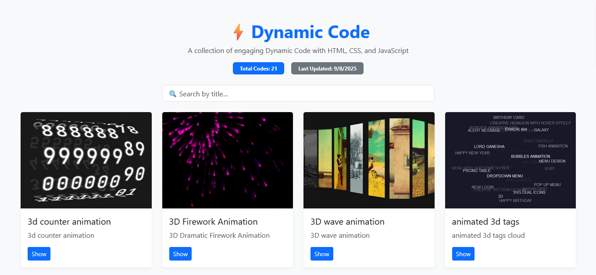
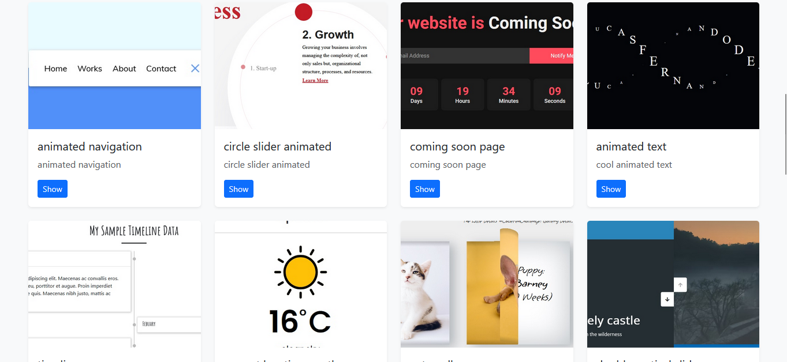
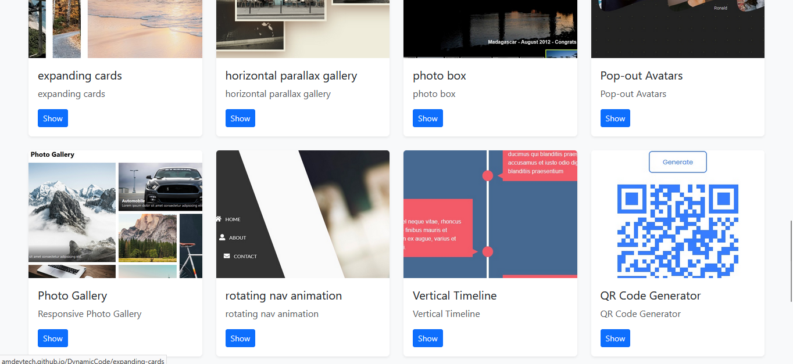

# ⚡️ DynamicCode

**DynamicCode** — A collection of ready-to-use tools and components built with **HTML, CSS, and JavaScript** to create eye-catching and engaging **dynamic animations** for web projects.

[](https://amdevtech.github.io/DynamicCode/)
[](LICENSE)

---

## Summary

DynamicCode provides lightweight, customizable, and visually appealing animation effects. Each demo is designed to be easily integrated into any website, enhancing user experience and adding interactive flair without heavy dependencies.

---

## Screenshot







---

## Explanation of use

1. Browse the available animation cards from the main page.
2. Click **Show** on any card to view the live demo of that effect.
3. Copy and integrate the provided HTML, CSS, and JavaScript snippets into your own project.
4. Customize styles and parameters as needed to match your design.

---

## Usage (Quick start)

1. Clone the repository:
   ```bash
   git clone https://github.com/amdevtech/DynamicCode.git
   ```
2. Open `index.html` in your browser.
3. Search or browse available effects.
4. Copy code snippets into your own web project.

---

## Technologies Used

- **HTML5** — structure and markup.
- **CSS3** — styling and animations.
- **JavaScript** — interactivity and dynamic behavior.
- **Bootstrap 5** — responsive layout and UI components.

---

## Roadmap

### ✅ Completed tasks
- Responsive Bootstrap-based card display.
- Search and filter animations by title.
- Live demo integration for each animation.

### 🚧 Planned / To-do tasks
- Adding more animations and effects.
- Expanding categories (text, navigation, galleries, sliders, etc.).
- Enhanced documentation for each demo.

---

## Author
**Ahmed Hafez** — DynamicCode
